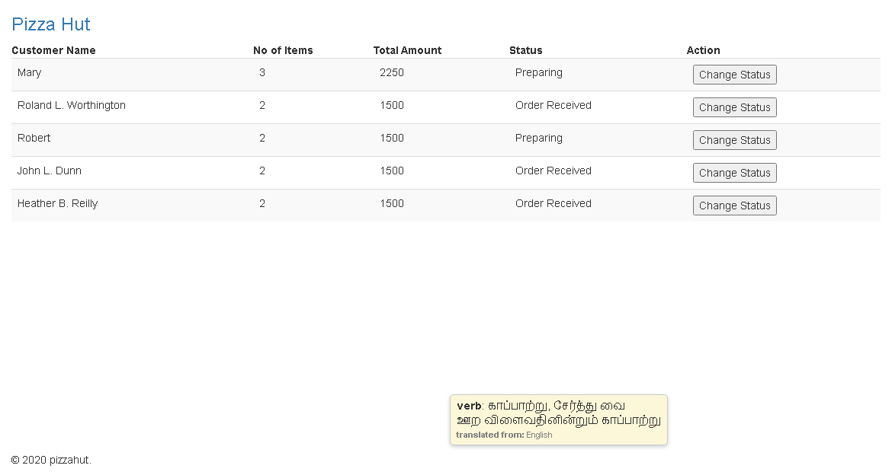
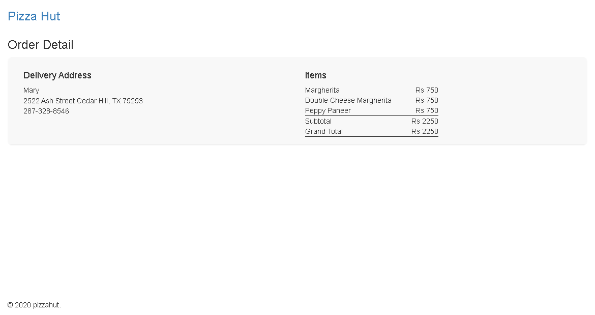

# PizzaHutOrders

This project was generated with [Angular CLI](https://github.com/angular/angular-cli) version 9.0.5.
Two pages are created one for order list view and another one for order detail page.

## Development server

Run `ng serve` for a dev server. Navigate to `http://localhost:4200/`. The app will automatically reload if you change any of the source files.

## JSON server

Run `json-server --watch mockdata/data.json` for a json server. Navigate to `http://localhost:3000/`. Check json serer running or not and check no of collections(api) used. 

## Development and JSON server

Run `concurrently --kill-others \"npm run mock:server\" \"npm run start\"` for a dev server and json server. The two server started in one command.

## Dependencies

 - Boostrap (npm install bootstrap@3.4.1 --save).

## Dev Dependencies

 - Json Server (npm install json-server --save-dev).
 - concurrently (npm install concurrently --save-dev).

## Components

 - Order list view component
    

 - Order detail view componet
    
 

